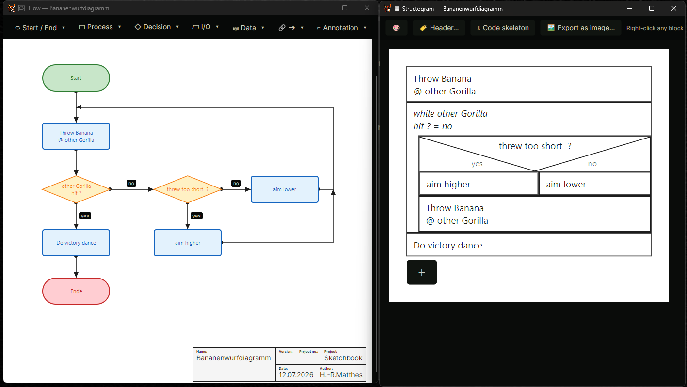
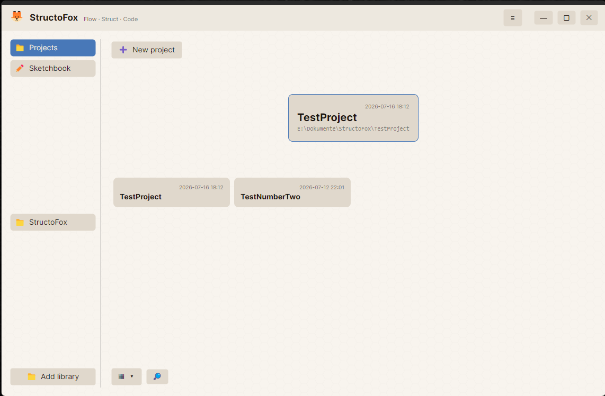
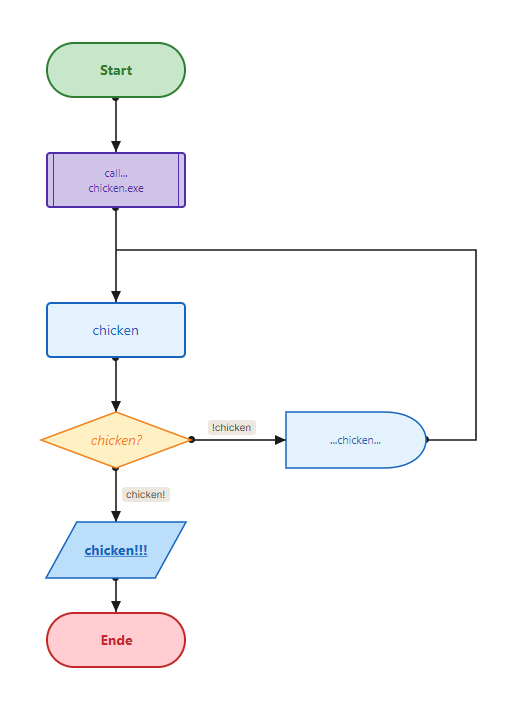
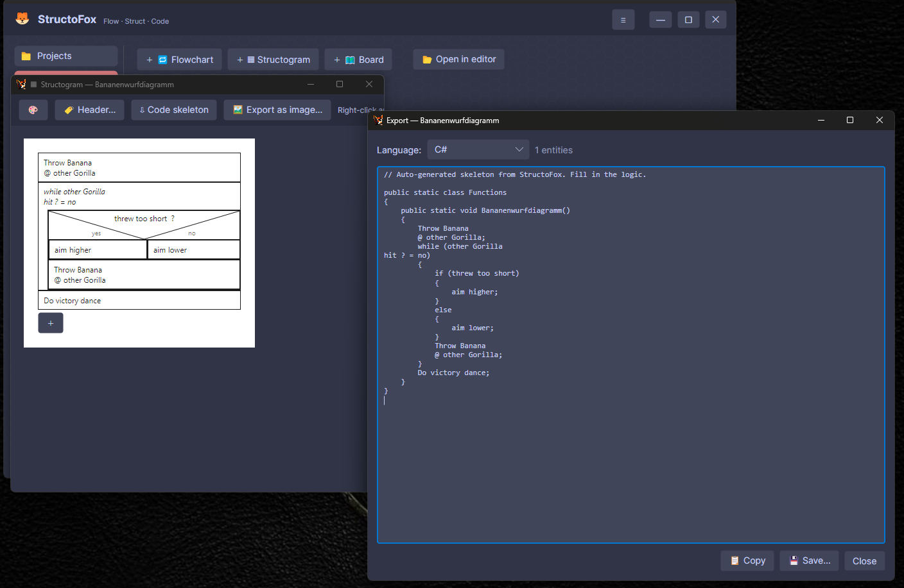
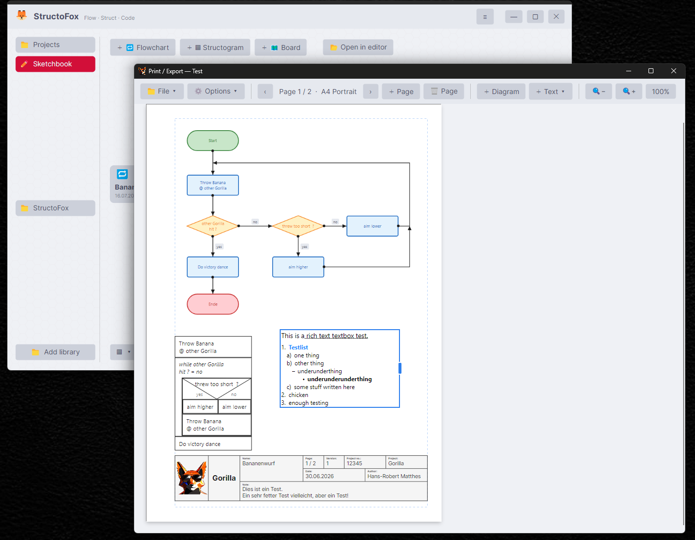
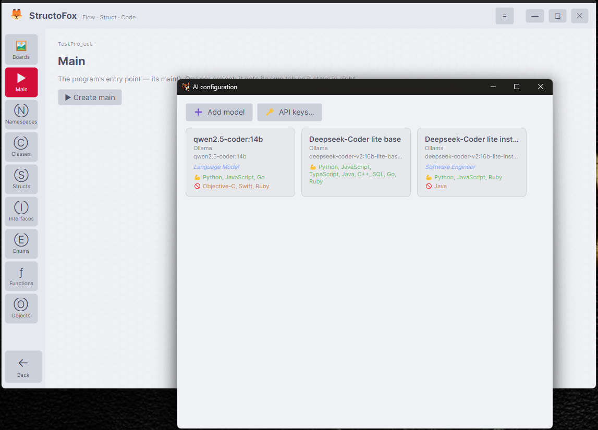
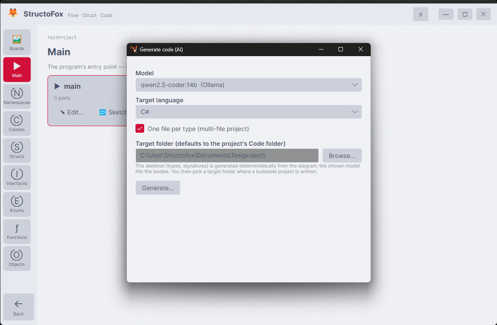

<div align="center">


# StructoFox 🦊

**Flow · Struct · Code**

*Plan and build code from diagrams.*

</div>

---

StructoFox is a **code-planning and generation tool**. You design software visually —
classes and their relationships, then the logic of each function as a **flowchart**
(Programmablaufplan, DIN 66001) or a **structogram** (Nassi-Shneiderman, DIN 66261) —
and StructoFox turns it into real, buildable source code across many languages.

> Not a code *reader* like Structorizer — StructoFox is about **planning and building**.
> The diagram is the source of truth; the code falls out of it. The deterministic parts
> (structure, signatures, structograms) generate code with **no AI**; an optional AI
> plugin fills only the gaps that can't be derived.

**Status:** `0.9.9-beta` — feature-complete for the first release; hardening and polish.

**Languages:** the UI ships fully in **English** and **German**; more can be added as
drop-in language packs (`Languages/<code>.json`).

<p align="center">
  
</p>
<p align="center"><em>A flowchart (DIN 66001) and the Nassi-Shneiderman structogram it converts into — one button, plus a DIN title block.</em></p>

---

## Download

Grab a package from the **[latest release](https://github.com/StructoFox/StructoFox/releases/latest)**:

| Platform | Package | Notes |
|----------|---------|-------|
| **Windows** 10/11 (x64) | `…-win-x64-slim.zip` | Slim build — needs the **.NET 10 Desktop Runtime**. Unsigned → click *More info → Run anyway*. |
| **Linux** (x64) | `…-linux-x64.tar.gz` | Self-contained — no .NET needed. `tar -xzf …`, then `./StructoFox`. |
| **macOS** 12+ (Intel) | `…-macOS-x64.tar.gz` | Self-contained, **unsigned & untested**: `xattr -dr com.apple.quarantine StructoFox.app && open StructoFox.app`. |

Each package bundles the `Themes/` and the optional `Plugins/AiCodegen/`. Windows is built by
hand; the Linux and macOS packages are built automatically by GitHub Actions on each release tag.

---

## What you can do

### Model your structure

Namespaces, Classes, Structs, Interfaces, Enums, Functions and Objects — each with fields,
methods (typed parameters), enum values and typed **data ports**. Arrange them as UML-style
cards on free **structure boards**; wire ports, set inheritance and interfaces, add **type
links**, bend connections with **reroute nodes**, and drop **free text notes** (single-line or
a full rich-text box) anywhere on the board.

<p align="center">
  
</p>
<p align="center"><em>Projects &amp; Sketchbook launcher — start a project, or sketch a diagram freely.</em></p>

### Draw the logic

Per function/method, in DIN-compliant editors:

- a **flowchart** (DIN 66001): start/end, process, decision, **multi-branch** (switch/case
  comb), I/O, subroutine, note; labelled arrows; multi-page via off-page connectors.
- a **structogram** (DIN 66261): nested statement / if-else / while / do-while / case blocks.

An **AI-free, Visual-Studio-style autocomplete** helps while typing node text — it suggests the
project's own types, objects, namespaces and functions (methods shown *with* parameters) plus
variables introduced earlier in the same flow, in the project's chosen language syntax.

<p align="center">
  
</p>

### From diagram to code — deterministically

The workflow is *(optional flowchart) → structogram → code*. A flowchart converts to a
structogram with one button — which doubles as a **clean-structure filter** (unstructurable
jumps are flagged, not silently miscompiled). The structogram then generates the method body
**deterministically — no AI** — as a buildable skeleton you can copy, save, or export as a full
multi-file project.

<p align="center">
  
</p>
<p align="center"><em>A structogram and the deterministic C# skeleton it produces (13 languages supported).</em></p>

### Compose print &amp; export documents

A built-in **Print / Export composer** lays out diagrams, standalone decoration blocks
(title/legend/info tables), headers with a page number, and **rich-text boxes** onto real paper
pages (A-series, Letter, …, portrait or landscape, mixed within one document). Export to
**PDF** (with **searchable, selectable text**), **TIFF** (single or multi-page), or **PNG** —
and single diagrams straight to an image from their editor.

<p align="center">
  
</p>
<p align="center"><em>The composer: diagrams, a rich-text box and a DIN title block on a multi-page A4 layout.</em></p>

### Generate buildable projects

Deterministic skeletons in **13 languages**, with **multi-file** projects (one file per type +
build/wiring files) for 12 of them: C#, C, C++, Java, Go, PHP, TypeScript, JavaScript, Python,
Rust, Kotlin, Swift (Verse is single-file). Optionally let an AI plugin fill the method bodies.

---

## AI is optional

The whole deterministic pipeline — structure, structograms, code export and the print composer —
runs **without any AI**. The **AI code generation is a removable plugin** (`Plugins/AiCodegen`):
leave it out and the feature simply isn't there (e.g. a school deployment). When present, it
drives **local or cloud models** to fill method bodies into the deterministic skeleton, with
per-language guidance and deterministic post-passes so even weak models produce compiling code.
API keys are stored only in the OS's native secret store, never in a file.

<p align="center">
  
</p>
<p align="center"><em>The AI plugin manages local (Ollama) and cloud models — each with its language strengths.</em></p>

<p align="center">
  
</p>
<p align="center"><em>The skeleton is generated deterministically from the diagram; the chosen model only fills the bodies.</em></p>

---

## Extending StructoFox (plugins)

StructoFox loads optional plugins — `.dll` drop-ins in the `Plugins/` folder — that add commands
to the **Extensions** menu (the AI code generation ships as one). A plugin only references the
UI-free `StructoFox.Core` and reads the project through the normal Core services.

See **[PLUGINS.md](PLUGINS.md)** for the guide: the contract, a minimal template, the csproj
setup, reading project data, custom themed UI, and localization — with the bundled `Sample`
(minimal) and `AiCodegen` (advanced) plugins as references.

---

## Themes &amp; ecosystem

- **OXSUIT themes** — StructoFox is themed with the
  [OXSUIT](https://github.com/Doombug75/OXSUIT) colour-theme XML standard: plain, portable
  colour definitions. Drop `.oxsuit` files into `Themes/`; no restart required. Design your own
  visually with the free [**OXSUIT Theminator**](https://github.com/Doombug75/Theminator) — a
  standalone theme editor and previewer.
- **ClaudetRelay integration** — StructoFox is the code-planning companion to
  [**ClaudetRelay**](https://github.com/Doombug75/ClaudetRelay), a multi-agent AI workspace. In a
  ClaudetRelay project, the **Code** button launches StructoFox straight into that project's
  cockpit — one flowchart/code editor, shared across both apps. StructoFox also runs fully
  standalone.

---

## Architecture

```
src/
  StructoFox.Core/            ← platform-neutral .NET library (net10.0), zero UI deps
    Models/                   ← CodeEntity, FlowChart, Structogram, board + print primitives
    Services/                 ← CodeExportService + ProjectExporter (13-language codegen),
                                StructogramConverter (PAP→NS), CodeCompletionService,
                                project / diagram / board persistence
  StructoFox.App/             ← Avalonia 12 desktop front-end + OXSUIT theming + plugin host
  StructoFox.AI/              ← provider layer (cloud + local), bundled by the AI plugin
  StructoFox.Plugin.AiCodegen ← optional AI code-generation plugin
  StructoFox.Plugin.Sample    ← minimal reference plugin
```

The **core has zero UI dependencies** and compiles on any .NET 10 target, so the same logic can
back multiple front-ends. Theming uses the **OXSUIT** colour-theme XML standard (plain colour
definitions → trivially cross-platform); drop `.oxsuit` files into `Themes/`.

---

## Requirements

- **Windows** 10 / 11, **Linux** (x64), and **macOS** 12+ — built on **.NET 10** and
  **Avalonia 12** (the Windows build needs the .NET 10 Runtime; the Linux/macOS builds are
  self-contained).
- Optional: an AI provider (local server or cloud API key) only if you use the AI plugin —
  everything else works without any AI.

---

## License

MIT — see [LICENSE](LICENSE). © 2026 Hans-Robert Matthes.
